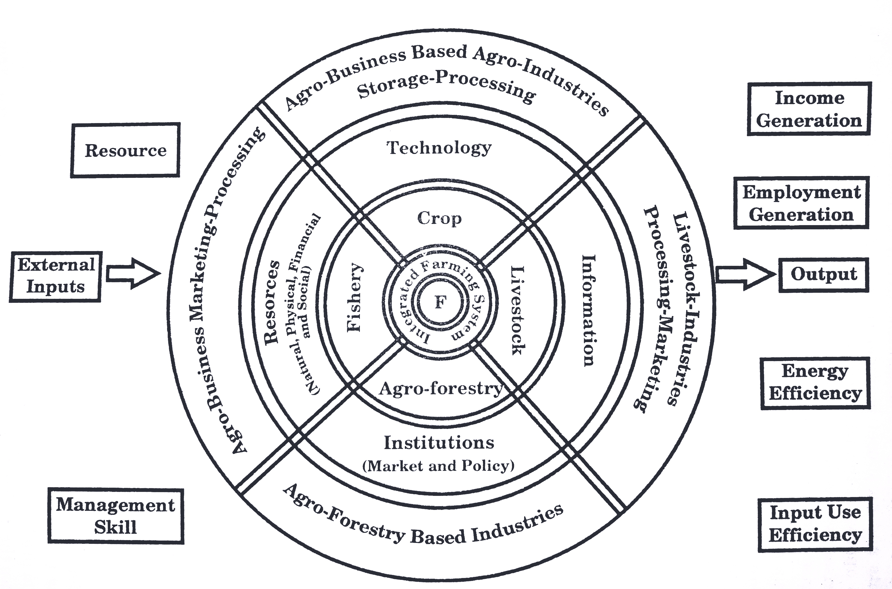
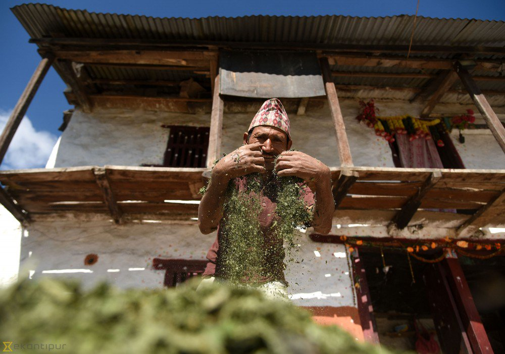

```{r setup, include=FALSE}
library(knitr)
require(tidyverse)
set.seed(453)
# invalidate cache when the package version changes
knitr::opts_chunk$set(tidy = FALSE, echo = FALSE, 
                  message = FALSE, warning = FALSE,
                  out.width = "45%")
options(knitr.table.format = "latex")
options(knitr.kable.NA = "", digits = 2)
options(kableExtra.latex.load_packages = FALSE)
```

# Introduction to farm management

## Meaning and definition

### Meaning and definition

- Farm management comprises of two words
  \begin{itemize}
  \item "Farm" means a \alert{piece of land} where crops and livestock enterprises are taken up under a \alert{common management} and has specific \alert{boundaries}.
  \item "Management" means the act or art of managing.
  \end{itemize}
- Gray^[Introduction to Agricultural Economics, 1924] states, the art of managing a farm successfully, as measured by the test of profitableness, is called farm management.
- Farm is an economics and social institution
- In a narrow sense, it might refer to the act of daily work supervision of farm labour and carrying out the directives of seniors by the public and private employed farm managers.
- Broadly, it is also recognized as production economics or agricultural economics.
- Farm management is a rational resource allocation proposition, particularly from the point of view of an individual farmer.

###

- Because:
    - On one hand, a farmer has a certain set of farm resources such as land, labour, farm building, working capital and farm equipment, etc.
    - On other, the farmer has a set of goals/objectives to achieve, may be to maximize family satisfaction through increasing net farm income.
    - Amidst, farmer him/her-self is limited by the specific degree of ability and awareness.
    - Everything must be bridged together
- $\leadsto$ 
    - A science which deals with judicious decisions on the use of scarce farm resources, having alternative uses to obtain the maximum profit and family satisfaction on a continuous basis from the farm as a whole and under sound farming programmes.
    - A science of decision making or science of choice

<!-- - \mbox{{\large\parbox[b][.5in][t]{.5in}{\alert{Farm Management}}} -->
<!--   $\qquad\qquad$\includegraphics[width=.95in]{figs/farm_managed.jpg}} -->

###

- It assists farmer in deciding problems like:
  - What to produce
  - How much to produce
  - How to produce
  - When to buy and sell
  - Dealing with organization and managerial problems
- Changes encountered by a farmer are:
  - Fluctuation in prices
  - Weather variation
  - Inventions in farming methods
  - Changes in socio-economic environment (including government policies, social response and values)
  
### What makes a successful farm manager

- Eight processess or functions of management have been been proposed by Nielson
  - Formulation of the goals or objectives of the firm
  - Recognition and definition of a problem or opportunity
  - Obtaining information and observation of relevant facts
  - Specification and analysis of alternatives
  - Decision-making -- chosing an alternative
  - Taking action
  - Bearing responsibility for the decision or action taken
  - Evaluating the outcome
  - Revision

## Features and components

### Nature of farm management

1. Practical science
2. Profit orientation
3. Integration of wider areas of sciences
4. Micro approach to management of farm units
5. Farm unit as a whole 

### Components of farm management

1. Boundaries
2. Household
3. Operating plan
4. Production-enabling resources
5. Final product-generating enterprises
6. Resource generating activities
7. Agro-technical processes
8. Structural (interdependence) coefficients
9. Time dimension

## Scope

### Scope of farm management

- Farm management is considered to be microeconomics in its scope as it deals with allocation of resources at the level of individual farm operation and organization.
- Seeks to help farmers in decision making, hence has a role to play in extension of innovation.
- Determination of most efficient production method of selected enterprises. 
- Tries to explain all aspects of farming which have bearing on the economic efficiency of farm.
- These features highlight research prospect in farm management science.
- Organization of agricultural resources and farm enterprises so as to make a complete farm unit. 
- Maintenance of farm records, account and determination of various efficiency parameters and it helps in adjusting against time and uncertainty elements on the farm -- teaching/educational aspect of farm management

## Importance

### Importance of farm management

- Increase in farm resource allocation efficiency
- Systematic assessment of farm problems and identify cause and remedial measures
- Increase in farm income through increased productivity
- Technological progress and agricultural modernization
- Mechanization and industrial development
- Generation of employment opportunities
- Farm management as an education tool
- Opportunities of resource sharing among enterprises, and resource combination optimization. for e.g., sloping land utilized for pig-cum-poultry farming.
- Improvement of living standard and the level of satisfaction of farming household
- Reduction in poverty and improvement of national economy
- Bringing about agricultural revolution

## Problems

### Problems of farm management (specific to Nepal)

- Farming rarely as a capital intensive enterprise. This leads to reduced commercial efficiency and technology adoption.
- Problem of land fragmentation, parcelization and subsistence state of farming.
- Absence of long term farm planning
- Poor enterprise mix
- Marketing problems
- Input supply problems
- Product standardization and quality regulation
- Agroclimate and topography
- Problem of rural infrastructures
- Inadequate microcredit and financing facilities
- Poor managerial efficiency.

### Characteristics of farming as a business

\footnotesize

1. Primary forces of production:
  - Biological nature
  - Diminishing returns at earlier stage
  - Wide and scattered production
  - Importance of land tenure system
2. Size of production unit (relatively small sized)
3. Heavy dependence on climatic factors
4. Frequency and speed of decisions
5. Changes in prices
6. Standardization of practices and products
7. Turn over (Capital turnover)
8. Financing
9. Home and business
10. Fixed and variable costs
11. Inelastic demand for farm products
12. Time rigidities in consumption

# Management of farm resources

##

### Capital and credit

- One of the four essential factors of production alongside, land, labor and enterprise.
- Broadly defined, capital is the money invested in the physical inputs used in agricultural production.
- It is needed to purchase or rent productive assets, pay for labor and other inputs, and finance family living and other personal expenditures. The basic questions to be answered are:
1. How much total capital should be used?
2. How should limited capital be allocated among its many potential uses?

- Credit is important to capital acquisition and use. 
- It is the ability to borrow money with a promise to return the money in the future and pay interest for its use. 
- The use of credit allows farmers to acquire productive assets and pay for them later with the income they generate.

### 

- Production process that use a lot of capital relative to labor are capital intensive, those that use comparatively little capital are labor intensive.
- A firm's asset are its capital -- it may include fixed capital (machinery, buildings, and so on) and working capital (stocks of raw materials and part-finished products, as well as money used up in production process).
- Financial capital includes money, shares and bonds, equity (owner's and outside equity)
- Human and social capital are often linked to capital types.
- Capital formation is genereally done through loans in a farm
  - Types of loans are based on: length of repayment (short, intermediate and long), use of funds (Real estate, non-realestate and personal), and types of security pledged (Secured and unsecured)

### Land control and use

- Pending colonisation of the moon, available in fairly fixed supply
- Probably most valuable asset
- A permanent and immobile resource that does not depreciate or wear out
- Marginal increases are possible by reclaiming land from the sea and cutting down forests (which may impose large economic costs by damaging the environment), but the expansion of deserts may slightly reduce the amount of usable land. 
- Owners earn money from land by charging rent.

###

- Land is described legally with description of size, location and shape.
- The difference in land resources among farms explains why one of the first steps in whole-farm planning is to make a complete inventory of the land, including soil types, drainage, slope, and fertility.
- Land management includes: Owner managed, leased (Cash share lease, crop share lease, labor share lease)
- Under land use, aspects such as farm layout, soil and nutrient management, etc. are dealt.

### Human resource management

- It is mobile but limited resource.
- Among the things that determine the supply of labour are the number of able people in the population, their willingness to work, labour laws and regulations, and the health of the economy and firms. 
- Demand for labour is also affected by the health of the economy and firms, labour laws and regulations, as well as the price and supply of other factors of production.
- In a perfect market, wages (the price of labour) would be determined by supply and demand. But the labour market is often far from perfect. Wages can be less flexible than other prices; in particular, they rarely fall even when demand for labour declines or supply increases. 
- This wage rigidity can be a cause of unemployment.

### Enterprise

- An entrepreneur is somebody who has the idea and enterprise to mix together the other factors of production to produce something valuable. 
- They must be willing to take a risk in pursuit of profit.

# Farming systems

##

### Integrated farming system

```{r integrated-fs, fig.cap="Integrated farming system influenced by socio-economic, political and biophysical environment and managed by a farmer.", fig.width=4, fig.height=4, cache=TRUE, echo=FALSE, out.width="50%"}
# introducing farm and management

```

### Commercial farming system

```{r fig-nocap-margin-first, fig.width=4, fig.height=4, cache=TRUE, echo=FALSE, out.width="45%", fig.align='center'}
# introducing farm and management

```


# Farm management decisions

## Classification

### Classification

- Decisions can be classified based on:
  - Importance
  - Frequency
  - Imminency
  - Revocability
  - Available alternatives

## Decision stages in farm operation

\small

- In a typical production process, decision making can be grouped into following stages:

### Production organization and problem decisions

####

- Strategic decisions (Involves heavy investment and has long lasting effects)
  1. Size of farm
  2. Machinery and livestock programme
  3. Construction of buildings
  4. Irrigation, conservation and reclaimation programmes
- Operational Decisions (More frequent and involve relatively small investments)
  1. What to produce -- selection of enterprise
  2. How much to produce -- enterprise mix and production process
  3. How to produce -- selection of least cost method
  4. When to produce -- timing of production

### Administrative problem decisions

####

1. Financing the farm business
  - Optimum utilization of funds
  - Acquisition of funds -- proper agency and time
2. Supervision of work -- operational timing
3. Accounting and book keeping
4. Adjustment of farming business to government programmes and policies

### Marketing problem decisions

#### \alertb{Buying}
1. What to buy ?
2. When to buy ?
3. From whom to buy ?
4. How to buy ?

#### \alertc{Selling}
1. What to sell ?
2. When to sell ?
3. Where to sell ?
4. How to sell ?
