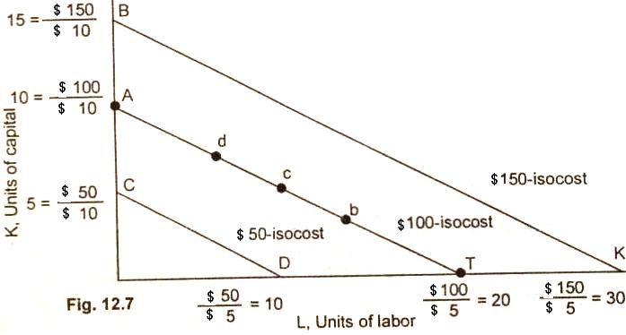
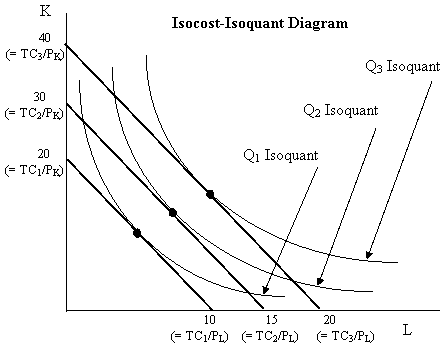

```{r setup, include=FALSE}
library(knitr)
require(tidyverse)
set.seed(453)
# invalidate cache when the package version changes
knitr::opts_chunk$set(tidy = FALSE, echo = FALSE, 
                  message = FALSE, warning = FALSE,
                  out.width = "45%", cache = TRUE)
options(knitr.table.format = "latex")
options(knitr.kable.NA = "", digits = 2, knitr.kable.NAN = "")
options(kableExtra.latex.load_packages = FALSE)
source("./../scripts/supply-demand-surplus.R")
source("./../scripts/graphics.R")
# require(extrafont) # requires for graphics.R
# require(extrafontdb)
# extrafont::loadfonts()
# extrafont::font_import()
```

# Introduction

## Background

- Production function or factor-product relationship deals only with one output and one variable input; all other inputs being considered fixed.
- Actually there are many situations where there a large number of inputs which are used to produce a farm commodity.
- The farmers are faced with the problem of deciding about the use of more than one resource or set of resources in substitution of other resources or set of resources.
- For example, it is common problem with the farmer to decide on how much of N, P and K fertilizer to use with a view to getting certain level of a crop output.
- Same problem applies to livestock rearing where how much of concentrates and green foodders to feed the milch animal to get certain amount of milk should be decided.

## Substitution

- There is possibility of substituting one factor ($X_1$) for another ($X_2$) as product level (Y) is held constant.
- Thus objectives of analysis of factor-factor relationship are:
  1. Minimization of cost at a given level of output
  2. Optimization of output to the fixed factors through alternative resource-use combinations
- In context of factor-factor substitution involving only two factors, adding more of a quantity of factor $X_1$ while replacing the amount of $X_2$ is referred to as factor $X_1$ substituting factor $X_2$.

## Example

- Let us suppose a farmer is producing wheat with various combinations of two fertilizer inputs -- Nitrogenous fertilizer and Phosphatic fertilizer. At various levels of input combinations, we obtains quanitites of output as shown in Table \ref{tab:np-factor-factor}.

```{r np-factor-factor}
np_factor_factor <- tribble(
  ~"phosphorus", ~"nitrogen", ~"yield",
  40, 40, 40.21,
  40, 60, 43.09,
  40, 80, 44.74,
  40, 100, 45.15,
  40, 120, 44.32, 
  40, 140, 44.02,
  60, 40, 41.87,
  60, 60, 45.51,
  60, 80, 47.90,
  60, 100, 49.06,
  60, 120, 48.98, 
  60, 140, 48.32,
  80, 40, 40.89,
  80, 60, 45.28,
  80, 80, 48.43,
  80, 100, 50.35,
  80, 120, 51.02, 
  80, 140, 50.54
)

np_factor_factor %>% 
  pivot_wider(id_cols = c(phosphorus, nitrogen), names_from = "nitrogen", values_from = "yield", names_prefix = "nitrogen_") %>% 
  rename_all(function(x)str_replace_all(x, "_", " ")) %>% 
  knitr::kable(caption = "Combination of inputs resulting in different levels of output.", booktabs = TRUE) %>% 
  kableExtra::kable_styling(font_size = 6, latex_options = "striped")
```

## Isoquant or iso-product curve

- An isoquant curve represents the various input combinations that can be used to produce a given output.
- Each point on an isoquant is the maximum output that can be produced with these input combinations.
- For example, suppose 80, 108 and 120 units of output (yield of wheat per ropani of land) can be produced using the following input combinations (nitrogen ($X_1$) and phosphorus ($X_2$) fertilizer in kg per ropani):

##

```{r np-factor-factor-output, fig.align='center', fig.cap="Isoquant curves showing combination of various level of inputs to produce different level of outputs", fig.width=4, fig.height=3, out.width="40%"}
np_ff_output <- tribble(
  ~"yield", ~"nitrogen", ~"phosphorus",
  "80 kg", 8, 0,
  "80 kg", 5, 1,
  "80 kg", 3, 4, 
  "80 kg", 2, 6, 
  "80 kg", 3, 9,
  "108 kg", 9, 2,
  "108 kg", 6, 3,
  "108 kg", 5, 4,
  "108 kg", 4, 7,
  "108 kg", 5, 10,
  "120 kg", 10, 3.5,
  "120 kg", 9, 3.6,
  "120 kg", 6, 5.5
)

# bezier fitting
np_ff_output %>% 
  group_by(yield) %>% 
  summarize(bezier_extrapolated = list(as_tibble(Hmisc::bezier(nitrogen, phosphorus, xlim = 8, evaluation = 1000)) %>% 
              rename(nitrogen = x, phosphorus = y))) %>% 
  unnest(bezier_extrapolated) %>% 
  ungroup() %>% 
  # filter(yield == "108 kg") %>%
  ggplot(aes(x = nitrogen, y = phosphorus, group = yield, color = yield)) +
  # geom_point(data = np_ff_output, mapping = aes(x = nitrogen, y = phosphorus)) +
  geom_path(linejoin = "round") +
  theme_bw()

# # spline and gam fitting are useless
# # spline fitting
# np_ff_output %>% 
#   group_by(yield) %>% 
#   summarize(bezier_extrapolated = list(as_tibble(spline(nitrogen, phosphorus, n = 20, 
#                                                         method = "fmm", ties = "mean")) %>% 
#                                          rename(nitrogen = x, phosphorus = y))) %>% 
#   unnest(bezier_extrapolated) %>% 
#   ungroup() %>%
#   # filter(yield == "108 kg") %>%
#   ggplot(aes(x = nitrogen, y = phosphorus, group = yield, color = yield)) +
#   geom_point(data = np_ff_output, mapping = aes(x = nitrogen, y = phosphorus)) +
#   geom_path(linejoin = "round") +
#   theme_bw()
# 
# # gam fitting
# np_ff_output %>% 
#   group_by(yield) %>% 
#   ggplot(aes(x = nitrogen, y = phosphorus, group = yield, color = yield)) +
#   geom_point(data = np_ff_output, mapping = aes(x = nitrogen, y = phosphorus)) +
#   stat_smooth(
#               formula = y ~ s(x, k = 3), method = "gam", se = FALSE) +
#   # geom_path(linejoin = "round") +
#   theme_bw()
# 

# # above graph can be drawn with splines
# # xspline
# require(ggforce)
# require(ggalt)
# np_ff_output %>% 
#   group_by(yield) %>% 
#   ggplot(aes(x = nitrogen, y = phosphorus, group = yield, color = yield)) +
#   geom_point() +
#   stat_xspline(geom = "path", spline_shape = .4) +
#   # geom_path(linejoin = "round") +
#   theme_bw()

```

##

<!-- Note: Since isoquants are similar in nature to indifference curves (they are derived from same basic cobb douglas utility/production function), we can model the problem of isoquant mapping using computational algebra technique. -->

Suppose a farmer has Rs 10000 of fund outlay for fertilizer purchase. His budget line for purchase of Nitrogen and Phosphorus fertilizer purchase is shown in Figure \ref{fig:budget-line-fertilizer}.

```{r budget-line-fertilizer, fig.width=5, fig.height=4, fig.cap="Budget line for outlay of Rs 10000 for fertilizer purchase at Rates of Rs 30 per kg for Nitrogen fertilizer and Rs 50 per kg for Phosphorus fertilizer."}
# provide a budge/isocost line
total_budget <- 10000
price_x <- 30
price_y <- 50

n_x <- total_budget / price_x
# n_x

n_y <- total_budget / price_y
# n_y

slope <- -n_y / n_x
# slope

# budget function
budget_fun <- function(x) slope*x + n_y

ggplot() +
  stat_function(data = tibble(x = seq(0, 350, 15)), aes(x = x), 
                fun = budget_fun, color = "purple", size = 1.5) +
  annotate(geom = "label", x = 75, y = budget_fun(75), 
           label = "Budget", color = "purple") +
  labs(x = "Phosphorus fertilizer", y = "Nitrogen fertilizer") +
  scale_x_continuous(expand = c(0, 0), breaks = seq(0, 350, 50)) +
  scale_y_continuous(expand = c(0, 0), breaks = seq(0, 250, 50)) +
  coord_cartesian(xlim = c(0, 350), ylim = c(0, 250)) +
  theme_bw()
```

##

- We can show the isoquant lines of using those two inputs in various combinations to produce different levels of Wheat yield (kg). The least cost combination of inputs with outlay of Rs 10000 is shown in Figure \ref{fig:least-cost-combination}.

<!-- Note: Isoquant is a cobb douglas function -->

```{r isoquant-fertilizer-yield, results="asis"}
production_fun <- function(x, y) 1.2*x^0.8*y
# interestingly, both x and y can't have non-integer exponents,
# if we are solving for y, x is allowed to take any integer/non-integer 
# exponent but y must be an integer, otherwise if
# y is a non-integer then, Max evaluation stack depth error occurs

# # production function for 50 kg N and 45 kg P
# production_fun(50, 45)

# this function needs to be arranged for showing combinations of two fertilizers that would produce the same yield. Ryacas comes to the rescue
require(Ryacas)

# # utility function may also be defined the following way:
# production_fun <- "Solve(x^0.82 * 1.6 * y^0.95 ==P, y)"
# production_solved <- yac(production_fun)

# but we will use the old approach, first define symbols
x <- ysym("x")
y <- ysym("y")
P <- ysym("P")
production_solvedy <- solve(production_fun(x, y), P, "y")
# production_solvedy %>% tex()

# now evaluate the utility_solvedy function
production_solver_r <- function(lx, lP){
  # note: should have Ryacas function for "y" in the parent environment
  # lx: x values to evaluate function
  # lP: P values to evaluate function
  # both x and P should be same length or the shorter will be recycled
  production_fun_r <- str_sub(str_extract(yac_str(production_solvedy), "(?<=\\=\\=).*"), start = 1, end = -2)
  eval(parse(text = production_fun_r), list(x = lx, P = lP))
  }

# production_solver_r(lx = 4:50, lP = 5)

# # find exact point where production curve and budget line meet
# partial derivative with respect to x
production_derivative_x <- deriv(production_fun(x, y), x)

# partial derivative with respect to y
production_derivative_y <- deriv(production_fun(x, y), y)

# marginal rate of technical substitution of y for x
mrts <- simplify(production_derivative_x/production_derivative_y) # this gives some undefined values

# remove unwanted expression
mrts_expression <- str_extract(yac_str(mrts), pattern = "\\(.*\\)")

# solve for marginal rate of technical substitution by equating with price ratio 
mrts_solved <- function(my_x){
  solve(eval(parse(text = mrts_expression)), price_x/price_y, "y") %>% 
    yac_str() %>% 
    str_extract("(?<=\\=\\=).*") %>% 
    str_sub(start = 1, end = -2) %>% 
    parse(text = .) %>% 
    eval(list(x = my_x))
  }

# If we set rate of technical substitution equal to this price ratio and rearrange the formula to be in terms of y, we’ll have the official price-attuned marginal rate of substitution (or slope of the isoquant curve).

# optimal root
optimal_x <- uniroot(function(x)budget_fun(x) - mrts_solved(x), c(0, 350))$root
optimal_y <- budget_fun(optimal_x)

# point on isoquant
maximum_output <- production_fun(optimal_x, optimal_y)
maximum_output <- round(maximum_output, 0)
```


```{r least-cost-combination, fig.cap="Least cost combination of two factors for Wheat production", fig.width=6, fig.height=4}

ggplot() + 
  # Budget line
  stat_function(data = tibble(x = seq(0, 350, 2)), aes(x = x),
                fun = budget_fun, color = "#a35c8c", size = 1.5) +
  # use lapply for multiple curves
  map2(.x = c(1000, 2500, 5000, maximum_output), 
       .y = c("#152683", "#425321", "#31c542", "#a2b132"), 
       .f = function(m, color)stat_function(data = tibble(x = seq(0, 350, 2)), aes(x = x),
                                       fun = production_solver_r, args = list(lP = m),
                                       color = color, size = 1.5)) +
  pmap(list(c(40, 100, 180, 240), 
            c(1000, 2500, 5000, maximum_output), 
            c("#152683", "#425321", "#31c542", "#a2b132")), 
       .f = function(m, n, color){annotate(geom = "label", x = m, y = production_solver_r(m, n), 
                                           label = paste("Production = ", n), color = color, size = 1.8)}) +
  labs(x = "Nitrogen fertilizer", y = "Phosphorus fertilizer") +
  # Budget annotation
  annotate(geom = "label", x = 50, y = budget_fun(50), 
           label = "Budget = 10000", color = "#a35c8c", size = 1.8) +
  scale_x_continuous(expand = c(0, 0), breaks = seq(0, 350, 50)) +
  scale_y_continuous(expand = c(0, 0), breaks = seq(0, 300, 50)) +
  coord_cartesian(xlim = c(0, 360), ylim = c(-10, 360)) +
  theme_light()
```


##

- Isoquants can be traced to different level of outputs. We can imagine that there is an isoquant for every output level between and including lowest and highest production level.
- The Figure \ref{fig:np-factor-factor-output} shows the isoquant map of three isoquant curves.

## Properties of isoquants

- Isoquants, like indifference curves, slope downward form left to right (i.e. have negative slope)
- No to isoquants can intersect each other
- Isoquants, like indifference curves, are convex to the origin; this implies the diminishing returns to a variable factor.

# Types of factor-factor relationships

##

- The shapes of the isoquants and production surface will depend upon the manner in which the variable inputs are combined to produce a particular level of output.
- There can be 3 categories of such combinations of inputs:
  1. Fixed proportion combination of inputs
  2. Constant rate of substitution, and
  3. Varying rates of substitution

## Fixed proportion combination

- There are certain enterprises or products which can only be produced if inputs are added in fixed proportion at all levels of production.
- In this case there is no decision problem because the inputs combine in fixed proportion.
- An example situation is that of tractor-driver combination. Adding another tractor will necessitate addition of a driver too.
- Inputs combining in fixed proportions give rise to L-shaped isoquants.

```{r fixed-proportion}
tribble(
  ~"yield", ~"tractor", ~"driver",
  "2 tons", 1, 1, 
  "3 tons", 3, 3,
  "4 tons", 4, 4
) %>% 
  knitr::kable(booktabs = TRUE) %>% 
  kableExtra::kable_styling(latex_options = "striped")
```

##

#### Marginal rate of substitution

- The rate at which two inputs can be substituted at a given level of output called MRS.
- It is denoted as: $\frac{\Delta X_2}{\Delta X_1}$.

## Constant rate of substitution

- The substitution at constant rate occurs when the amount of one input replaced by the other point does not change as the added input increases in magnitude.
- The isoquant of such combination is a straight line.
- For inputs which can be exchanged at a constant rate, the slope of the product contour is constant, or in other words, the substitution ratio remains same.

$$
\frac{\Delta X_{21}}{\Delta X_{11}} = \frac{\Delta X_{22}}{\Delta X_{12}} = \frac{\Delta X_{23}}{\Delta X_{13}} = ... = \frac{\Delta X_{2n}}{\Delta X_{1n}}
$$

##

```{r constant-rate-of-substitution}
tribble(
  ~"yield", ~"women_labor", ~"men_labor", 
  "2 tons", 10, 1,
  "2 tons", 8, 2,
  "2 tons", 6, 3,
  "2 tons", 4, 4,
  "2 tons", 2, 5
) %>% 
  rename_all(function(x)str_replace_all(x, "_", " ")) %>% 
  knitr::kable(booktabs = TRUE) %>% 
  kableExtra::kable_styling(latex_options = "striped")
```


## Varying rate of substitution

- There can be increasing rate of substitution on decreasing rate of substitution. It can also be the case that MRS changes from increasing initially to decreasing finally and vice versa.
- Substitution at increasing rate is rarely available in agriculture, but the substitution at decreasing rate is more common in agriculture.
- Decreasing rate of substitution means that every subsequent increase in the use of one factor replaces less and less of the other.
- Examples are substitution among concentrates and green fodder, labour and capital, and nitrogen and phosphorus, etc.

##

```{r varying-rate-of-substitution}
tribble(
  ~"yield", ~"nitrogen", ~"phosphorus", 
  "2 tons", 46, 0,
  "2 tons", 32, 2,
  "2 tons", 20, 4,
  "2 tons", 10, 6,
  "2 tons", 1, 8,
  "2 tons", 0, 10
) %>% 
  mutate(delta_n_x2 = tsibble::difference(nitrogen, 1, 1), 
         delta_n_x1 = tsibble::difference(phosphorus, 1, 1), 
         mrs_x2_x1 = abs(delta_n_x2/delta_n_x1)) %>% 
  knitr::kable(booktabs = TRUE, 
               col.names = c("Yield", "Nitrogen ($X_2$)", "Phosphorus ($X_1$)", 
                             "$\\Delta X_2$", 
                             "$\\Delta X_1$", 
                             "MRS ($\\frac{\\Delta X_2}{\\Delta X_1}$)"
                             ), 
               escape = FALSE) %>% 
  kableExtra::kable_styling(latex_options = "striped")
```

# Cost minimization

## Isocost line (price line/budget line/iso-outlay line/factor cost line)

- All possible combination of two inputs which can be purchased with a given outlay or budget.

```{r}

```

##

**Important points regarding isocost line**:

- As the total outlay increases the isocost line moves farther away from the origin.
- Isocost line is straight line because input prices do not change with the quantity purchased.
- The slope of isocost line indicates the ratio of factor prices.

## Least cost combination of inputs

- There are innumerable possible combination of factors which can be used to produce a particular level of output. The problem is to find out the combination of inputs which should cost the least, a cost minimization problem.
- There are three methods to find out the least cost combination of inputs.
  - Arithmetic method
  - Algebraic method
  - Graphical method

## Arithmetic method

- One possible way to determine the least cost combination is to compute the cost of all possible combinations of inputs and then select one combination with minimum cost. This method is suitable where only a few combination produce a particular level of output.

- Suppose price of input1 is Rs 3 and the price of input2 is Rs 2.

```{r arithmetic-least-cost-determination}
tribble(~"input1", ~"input2", ~"cost_input1", ~"cost_input2", ~"total_cost", 
        10, 3, NA, NA, NA,
        7, 4, NA, NA, NA, 
        5, 6, NA, NA, NA, 
        3, 8, NA, NA, NA, 
        2, 12, NA, NA, NA
        ) %>% 
  mutate(cost_input1 = input1 *3, 
         cost_input2 = input2 *2) %>% 
  rowwise() %>% 
  mutate(total_cost = sum(c_across(cost_input1:cost_input2))) %>% 
  knitr::kable(booktabs = TRUE, col.names = c("Input 1", "Input 2", "Input 1 Cost", "Input 2 Cost", "Total Cost"))
```

##

The above table shows 5 combinations of inputs which can produce a given level of output. The total cost of each combination of inputs is computed. Out of 5 combinations, 3 units of input1 and 8 units of input2 is the least combination of inputs. i.e. Rs. 25.

## Algebraic method (Steps)

1. Compute marginal rate of technical substitution

$$MRS = \frac{\textrm{Number of units of replaced resources}}{\textrm{Number of units of added resources}}$$

or,

$$MRS(X_1 \textrm{ for } X_2) = \frac{\Delta X_2}{\Delta X_1}$$
and,

$$MRS(X_2 \textrm{ for } X_1) = \frac{\Delta X_1}{\Delta X_2}$$

##

2. Compute price ratio (PR)

$$PR = \frac{\textrm{Price per unit of added resource}}{\textrm{Price per unit of replaced resource}}$$

So, 

$$PR = \frac{P_{X_1}}{P_{X_2}}$$ if $MRS(X_1 \textrm{ for } X_2)$, and

$$PR = \frac{P_{X_2}}{P_{X_1}}$$ if $MRS(X_2 \textrm{ for } X_1)$

##

3. Work out the least cost combination by equating MRS and PR. i.e.,

$$
\frac{\Delta X_2}{\Delta X_1} = \frac{P_{X_1}}{P_{X_2}}
$$

or,

$$
\frac{\Delta X_1}{\Delta X_2} = \frac{P_{X_2}}{P_{X_1}}
$$

- The least cost combination is obtained when, $MRS = PR$

## Graphical method

- Since the slope of isoquant indicates Marginal Rate of Technical Substitution (MRTS) and the slope of isocost line indicates factor price ratio, minimum cost for given output will be indicated by point of tangency between these two lines.

- Isocost and isoquant lines are drawn on the same graph for different levels of production. The least cost combination will be at the point where isocost line is tangent to the isoquant; i.e. MRS = PR

# Isocline, ridge lines and expansion path

## Isocline

- There can be number of possible output levels as shown in figure \ref{fig:isocline-expansion-path} and least cost combination can be found out for these various output levels.

```{r isocline-expansion-path, fig.cap="Isoquant and isocost lines for different levels of output"}

```


##

**Features of isocline**

- Isocline passess through all isoquants at points where they have same slope
- It shows how the relative proportion of the factors changes as the output is increased.
- It shows that resources should be used along this line as long as MVP > MC of resources used.

## Ridge lines

- Represents the points of maximum output from each input, given a fixed amount of the other input. 
- On the ridge lines MPP is zero. 
- Ridge lines represent the region of economic relevance.
- Within the ridge lines MPP of both inputs is positive but decreasing.

## Expansion path

- The line or curve connecting the points of least cost combination for different levels of output is called expansion path. Expansion path is an isocline on which slope of isoquant (MRTS) equal the slopes of isocost line (Price ratio). 
- The expansion path indicates the best way of producing the different levels of output given the input prices and the technology. 
- If expansion path is a straight line through origin, it means inputs will be used in the same proportion at all output levels and hence it is called scale line. 
-It is curved; it implies the inputs will be used in various proportions.
