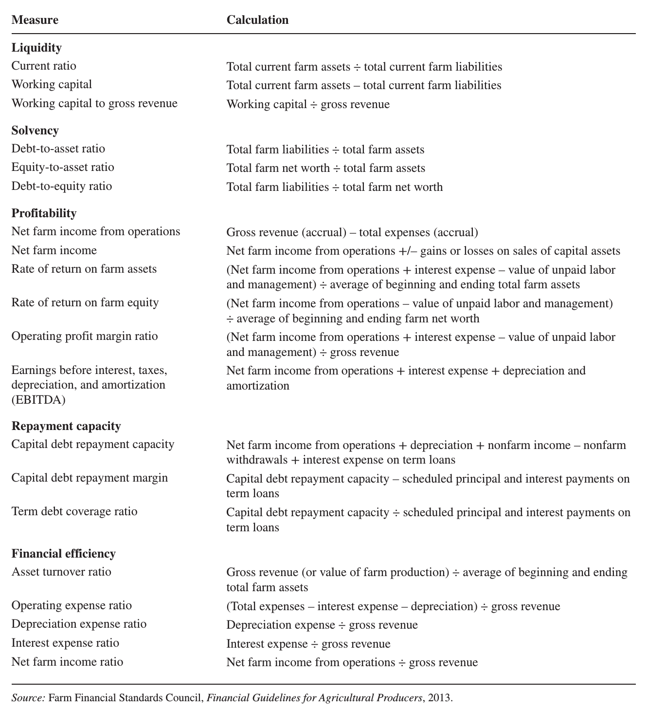
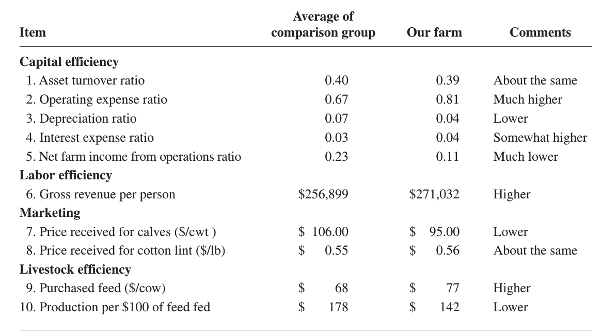

```{r setup, include=FALSE}
library(knitr)
require(tidyverse)
set.seed(453)
# invalidate cache when the package version changes
knitr::opts_chunk$set(tidy = FALSE, echo = FALSE, 
                  message = FALSE, warning = FALSE,
                  out.width = "45%", cache = TRUE)
options(knitr.table.format = "latex")
options(knitr.kable.NA = "", digits = 2, knitr.kable.NAN = "")
options(kableExtra.latex.load_packages = FALSE)
```

# Meaning and definition

##

- Some managers are able to generate more production or use fewer resources than their neighbors because they use their resources more efficiently. 
- A general definition for efficiency is the quantity or value of production achieved per unit of resource employed.

$$
\textrm{Efficiency} = \frac{\textrm{Production}}{\textrm{Resources used}}
$$

- If a comparison with other farms or with a budget goal shows that an operation has an adequate volume of resources but is not reaching its production goals, then some resources are not being used efficiently.

# Efficiency measures: Physical efficiency

## 

- Physical efficiency assigns technical coefficients to various physical inputs.
- These are typically the conversion rates of economically valuable products from inputs such as:
  - the rate at which seed, fertilizer, and water are converted into crops,
  - the rate at which feed is turned into livestock products,
  - kilograms of grain harvested per acre, 
  - pigs weaned per sow, and 
  - litres of milk sold per cow

##

1. Land use efficiency

- Yield per acre (production efficiency): $\frac{\textrm{Yield of the crop in the given farm}}{\textrm{Average yield of the locality}} \times 100$.
- Crop yield index: It is a measure by which the yields of all crops on a given farm are compared with the average yields of these crops in the locality.
- Intensity of cropping: $\frac{\textrm{Area cropped}}{\textrm{Total cultivated area}}\times 100$.
- System Index: $\frac{\textrm{Potential net income per ha on farm}}{\textrm{Average standard net income per hectare in the area}} \times 100$

##

2. Labor efficiency measures

- A productive man equivalency is the average amount of work accomplished by one man in the usual eight hour day (man day). 
- Measures of labor efficiency are: crop acres per man or per man-year, livestock maintained per man or per man-year.
- Gross profits per man or per man-year.

##

3. Machinery efficiency measures

- Helpful in judging the accomplishment of the farm machinery and equipment for making changes in their investment it required. A list of some common measures of machinery efficiency is given below:
  - Machinery and equipment cost per cropped acre: Only, total annual costs are considered including repairs, fuel, depreciation, etc. in estimating the cost.
  - Investment in machinery and equipment per crop acre.

# Efficiency measures: Financial efficiency

##

- The financial portion of a complete farm analysis is designed to measure the solvency and liquidity of the business and to identify weakness in structure or mix of the various types of assets and liabilities.
- The balance sheet and the income statement are the primary sources of data for calculating the measures related to the financial position of the business.

##

```{r farm-financial-ratios, fig.align='center', out.width="50%"}
# pdftools::pdf_convert("~/ddhakal/000readables/agribusiness_fm_cooperatives/farm_management_patricia_duffy.pdf", format = "png", pages = 121, filenames = "farm_financial_ratios.png", dpi = 220)


```


## Solvency 

- Solvency refers to the value of assets owned by the business compared to the amount of liabilities, or the relation between debt and equity capital. It also refers to what would be left in case all the assets are converted into cash and debts paid.
- Solvency ratios:
  1. Leverage ratio/debt equity ratio: $\frac{\textrm{Total liabilities}}{\textrm{Net worth}}$. Higher the leverage ratio, the farm operator has larger debt to pay in relation to his farm equity.
  2. Net capital ratio: $\frac{\textrm{Total assets}}{\textrm{Total liabilities}}$. A greater than one NCR indicates that the liquidation of farm business would generate adequate cash to repay the total liabilities.
  3. Working ratio: $\frac{\textrm{Working assets + Current assets}}{\textrm{Medium term liabilites + Current liabilities}}$.

## Liquidity ratios

- These indicate the ability of the farmer to generate sufficient cash in order to meet the debt obligations without disrupting his farm business. These are:
  1. Current ratio/Acid test ratio: $\frac{\textrm{Current assets}}{\textrm{Current liabilities}}$. This ratio indicates the extent to which current assets if liquidated would cover the current liabilities. i.e. the value of current assets for each rupee of current liability. It reflects the adequacy of cash, accounts receivables to cover all the liabilities. Higher the value of current ratio, more liquidity exists in the farm business.
  2. Debt structure ratio: $\frac{\textrm{Current liabilities}}{\textrm{Total liabilitites}}$. Lower the ratio, higher the liquidity position of farm.


# Economic efficiency (Capital efficiency + Physical efficiency)

##

```{r economic-efficiency-measures, fig.align="center", out.width="80%"}
# pdftools::pdf_convert("~/ddhakal/000readables/agribusiness_fm_cooperatives/farm_management_patricia_duffy.pdf", pages = 126, format = "png", filenames = "./figs/farm_economic_efficiency_ratios.png", dpi = 220)


```


## Asset turnover ratio

\footnotesize

- Measures how efficiently capital invested in farm assets is being used.
- Found by dividing gross revenue generated by market value of total farm assets.
- For e.g. an asset turnover ratio of 0.25 indicates that gross revenue for one year was equal to 25 percent of the total capital invested in business. At this rate, it would take four years to produce agricultural products with a value equal to the total assets.
- The operating profit margin ratio is a measure of profitability per unit produced. When the two are multiplied, they equate the rate of return on farm assets.

$$
ATR \times OMPR = ROA
$$

- So, overall profitability can be improved by: producing more units of output while maintaining the same profit margin per unit or by producing the same output but with a larger profit margin, or both.

## Operating expense ratio

- It is one of the four operational ratios are recommend to show what percent of gross revenue went for operating expenses, depreciation, interest, and net income. 
- The operating expense ratio is computed by dividing total operating expenses (excluding depreciation) by gross revenue. 
- Farms with a high proportion of rented land and machinery or hired labor will tend to have higher operating expense ratios.

## Depreciation expnese ratio

- This ratio is computed by dividing total depreciation expense by gross revenue. 
- Farms with a relatively large investment in newer machinery, equipment, and buildings will have higher depreciation expense ratios. 
- A higher-than-average ratio may indicate underused capital assets.

## Interest expense ratio

- Total farm interest expense (adjusted for accrued interest payable at the beginning and end of the year) is divided by gross revenue to find this ratio.
- Ratios higher than average, or higher than desired, may indicate too much dependence on borrowed capital or high interest rates on existing debt.

## Net farm income from operations ratio

- Dividing net farm income from operations by gross revenue measures what percent of gross revenue is left after paying all expenses (but before substracting any opportunity costs). 
- These four operational ratios will sum to 1.0 or 100 percent.
- They can also be calculated using the value of farm production as a base instead of gross revenue.
- In that case, the cost of purchased feed and livestock should not be included in operating expenses.
