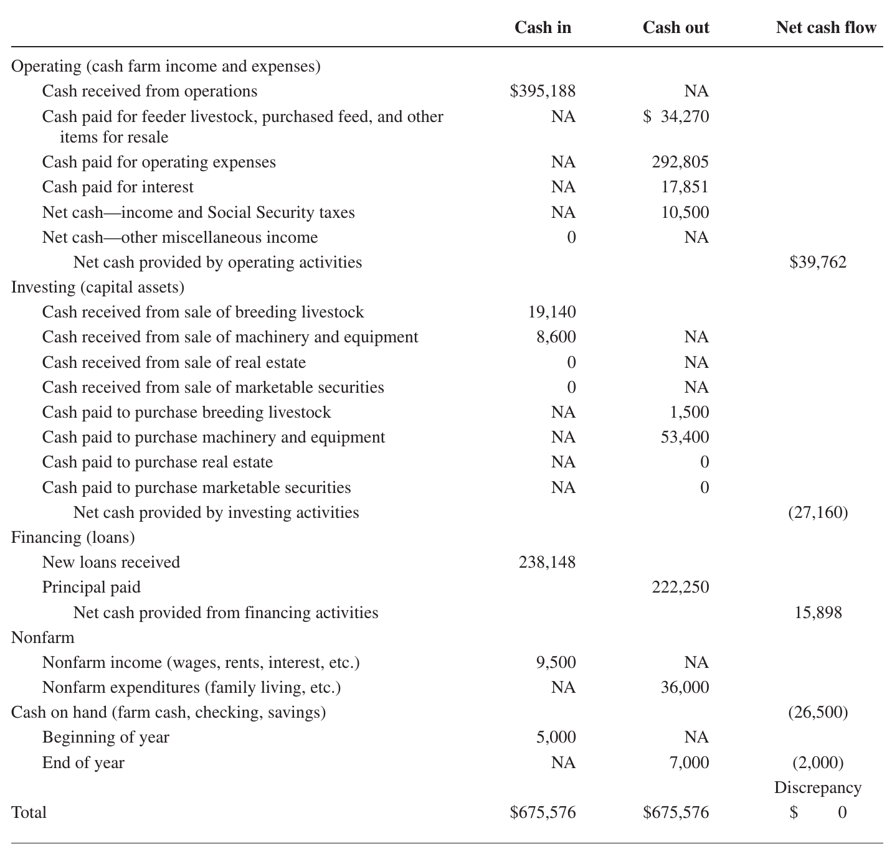

```{r setup, include=FALSE}
library(knitr)
require(tidyverse)
set.seed(453)
# invalidate cache when the package version changes
knitr::opts_chunk$set(tidy = FALSE, echo = FALSE, 
                  message = FALSE, warning = FALSE,
                  out.width = "45%", cache = TRUE)
options(knitr.table.format = "latex")
options(knitr.kable.NA = "", digits = 2, knitr.kable.NAN = "")
options(kableExtra.latex.load_packages = FALSE)
```

# Financial statements -- Preparation and analysis

## Background

- Financial statement shows the financial position and performance of a business
- Thoroughly understanding your business' financial performance is critical for success in today’s increasingly competitive agricultural environment.
- Successful managers use financial statements in combination with production records to identify strengths and weaknesses in their operation.
- Financial statements include the balance sheet, income statement, statement of owner equity, statement of cash flows.

## Balance sheet/Net worth statement

- The balance sheet, also called net worth or financial statement, is a summary of assets and liabilities of a business together with the statement of the owners' equity or net worth.
- This is a listing of all assets and liabilities of a farm at certain point of time. 
- This reports the financial strength and progress of the business.
- The term balance here implies that the value of the assets must be equal to the value fo liabilities plus owner's equity or net worth.

## Characteristics of a balance sheet

\footnotesize

- Pertains to specific point of time. i.e. 24th January, 1994.
- It characterizes the three essential components. i.e. assets, liabilities and net worth/owner's equity.
- It includes either owned or owed items and does not provide an accurate measure of total assets controlled, since many assets used in the production may be rented in.
- The balance sheet can be prepared for a farm business or farm operator's family. The assets are presented in order of payments or liquidity. Moreover the liabilities are written on left side while assets towards right side.
- The balance sheet does not indicate the progress or deterioration if the farm business, unless drawn overtime and net worth is compared.
- The balance sheet can be constructed on a cost basis/book value (purchase price or original cost minus depreciation) or current market value basis.
- Sometimes the physical data is also given to see the changes in inventory value, changes in unit prices or changes in both inventory and prices.
- Net worth is placed towards liabilities' side as the owners like creditor has claim against the business for the assets equal to net worth. In fact it is the liability of the business which owes that amount to the owner. But net deficit is placed on the asset side to show the shortage of assets.

##

**Liabilities**: It represents an amount which is owned to others whether payable in cash, kind or services.

**Current liability**: These are the debts payable within the operating year, normally 12 month. e.g., crop loan.

**Long term liabilities**: There are the obligations associated with the intermediate and long term assets, respectively. Once should consider outstanding principle which is due beyond 12 months as intermediate or long term liabilities. Medium term loans or liabilities are those whose maturity between 1 and 7 years while long term loans or liabilities possess maturity more than 7 years.

**Contingent liabilities**: These become due under specific circumstances, such as capital gain taxes. Such taxes become due only when the capital asset is sold. Such liabilities are only accounted for if the balance sheet is prepared on the market value basis.

<!-- ##  -->

<!-- Liabilities must have arisen from past transaction or events such as supplying goods or lending money to the business. When a liability is settled it will normally be through an outflow of assets (usually cash). The liabilities could include loans, debts, etc. Liabilities can be further sub-divided into: -->

<!--   - Current debts: Stores record of debts like household, medical, credit card, bank taxes, legal, etc. -->
<!--   - Mortgage: Details of any kind of mortgage debts like home, land, etc. -->
<!--   - Loans: Value of debts like bank loans, automobile loan, education loan, life insurance loan, personal loan, etc. -->
  
## 

- An asset is essentially a resource held by the business. The characteristics of an asset are:
  1. A probable future benefit must exist.
  2. The business must have an exclusive rights to control the benefit.
  3. The benefit must arise from some past transaction or event.
  4. The asset must be capable of measurement in monetary terms.

<!-- - Assets could include the cash, investment, etc. Assets can be further sub-divided into: -->
<!--   - Cash and bank accounts: Details of cash in hand, cheque accounts, saving account, money market funds, cash value of life insurance, etc. -->
<!--   - Investment (market value): Details of certificates of deposit, stocks, bonds, mutual funds, annuities, pension plans, etc. -->
<!--   - Personal property (present value): Details of automobiles, home furnishing, appliance, furniture, collections, jeweler, etc. -->
<!--   - These represent the value that are owned and classified according to time required to convert them into cash with a minimum loss. -->
  
##

- Assets can be further classified as follows in sequence of their liquidity,

**Current assets**: These are consumed within the single year and can be converted into cash without disrupting the farm business (sale of land disrupts the farm business)

**Medium term assets**: These assets cannot be converted or sold for cash in short period of time e.g. milch and draught animals, small equipment etc. These assets are not consumed within the year and continue to give returns beyond one year.

**Long term/fixed assets**: These are also part of production plan but are of permanent nature. Farm real state represents the major long term asset on the balance sheet for most farm operators.

<!-- ## Net worth -->

<!-- The owner's equity or net worth represents the residual entry in the account which balances the statement. Net worth in a year will change due to farm earnings, paid up capital, capital gains or losses etc. The assets and liabilities of the farm may change but the net worth remains the same this is because if increase in assets and liabilities would arise once purchased with credit the net worth may seem to arise but further the net worth would be reduced by diverting a part of loan for home consumption purpose, in fact if loans are borrowed it seems like the net worth is decreased however the net worth would be unaffected since debt has been used to restructure and improve the liquidity position of the farm. Net worth or equity or net assets or capital of a company/farm is calculated by calculating the difference between the Total Assets and the Total Liabilities. Looking at the equation in this way shows how assets were financed: either by borrowing money (liability) or by using the owner's money (owner's or shareholders' equity). A business operating entirely in cash can measure its profits by withdrawing the entire bank balance at the end of the period, plus any cash in hand. However, many businesses are not paid immediately; they build up inventories of goods and they acquire buildings and equipment. In other words businesses have assets and so they cannot, even if they want to, immediately turn these into cash at the end of each period. Often, these businesses owe money to suppliers and to tax authorities, and the proprietors do not withdraw all their original capital and profits at the end of each period. In other words, businesses also have liabilities. -->

<!-- ## Owner's equity -->

<!-- When a business wishes to acquire assets, It may raise the funds from the owner(s) or from other outside parties (recorded as liabilities) or from both. The owner's equity represents the claim of the owner(s) against the business. Some find it hard to understand how the owner can have a claim against the business, particularly when we consider the example of a sole-proprietor-type business where the owner is, in effect, the business. However, for accounting purposes, a clear distinction is made between the business (whatever its size) and the owner(s). It is seen as a separate entity with its own separate existence and when financial statements are prepared, they relate to the business rather than to the owner(s). Viewed from this perspective, any funds contributed by the owner will be seen as coming from outside the business and will appear as a claim against the business in its balance sheet. -->

## Example

\scalebox{0.60}{\begin{minipage}{1.0\textwidth}
\begin{itemize}
\item Net worth or equity or net assets or capital of a company/farm is calculated by calculating the difference between the Total Assets and the Total Liabilities.
\item An example Net worth statement of MudnBrick Commercial Vegetable and Livestock Farm is presented in Table \ref{tab:net-worth-state}.
\end{itemize}
\end{minipage}}

\scalebox{0.6}{\begin{minipage}{1.0\textwidth}

```{r net-worth-state}
net_worth <- readxl::read_xlsx("../data/concepts_of_economics.xlsx", sheet = "net_worth_state", col_names = FALSE)
net_worth[-c(1,2,3,4),] %>% 
  knitr::kable(format = "latex",
             caption = "Net worth statement",
             col.names = c("", "", "", ""), booktabs = TRUE) %>% 
  kableExtra::kable_styling(position = "center", full_width = FALSE, latex_options = c("striped", "HOLD_position"), font_size = 8) %>% 
  kableExtra::add_header_above(c("Net Worth Statement" = 4), bold = T) %>%
  kableExtra::add_header_above(c("Financial condition as of 2011-11-11" = 4), italic = T) %>%
  kableExtra::add_header_above(c("MudnBrick Commercial Vegetable and Livestock Farm" = 4), bold = T) %>%
  kableExtra::row_spec(row = c(1,2,8,9,15,16,21,23,24), bold = TRUE, align = "c")
```

\end{minipage}}

## Farm income statement/Profit and loss account

\footnotesize

- Balance sheet shows only the amount of wealth held by a business at one moment in time. 
- Profit generated during a period is a main concern of many users of financial statements.
- P\&L statement provides a picture of profitability of the farm. 
  - How much wealth (that is, profit) was generated, or lost, by the business over that period? 
- Profit (loss) is defined as the increase (decrease) in wealth arising from trading activities. 
- This is more accurately done using an accrual statement, which further accounts for inventory, accounts payable, and receivables, as well as depreciation expense.
- The difference between the total revenue and total expenses will represent either profit (if revenue exceeds expenses) or loss (if expenses exceed revenue). 
- The period over which profit or loss is normally measured is usually known as the "accounting period", or "financial period".

##

- Measuring profit is done after first identifying total revenue generated during a particular period of the business. 
- **Revenue** is simply a measure of the inflow of economic benefits arising from the ordinary activities of a business. 
- These benefits, which accrue to the owners, will result in either an increase in assets (such as cash or amounts owed to the business by its customers) or a decrease in liabilities. Some examples of the different forms that revenue can take are as follows:
  - sales of goods/crops (for example, of a producer)
  - fees for services (for example, of a packaging)
  - subscriptions (for example, of a cooperative)
  - interest received (for example, of an investment fund).

##

\footnotesize

- The total expenses relating to each period must also be identified. 
- **Expense** represents the outflow of economic benefits arising from the ordinary activities of a business. This loss of benefits will result in either a decrease in assets (such as cash) or an increase in liabilities (such as amounts owed to suppliers). Expenses are incurred in the process of generating revenue, or attempting to generate it. Examples of some of the more common types of expenses are:
  - the cost of buying goods that are subsequently sold - known as cost of sales or cost of goods sold
  - salaries and wages
  - rent and rates
  - farm machinery and vehicle running expenses
  - insurances
  - printing and stationery
  - energy expenses (heat and light)
  - telephone and postage.

## Example

```{r cost-return-an, echo=FALSE}
inc_state <- readxl::read_xlsx("../data/concepts_of_economics.xlsx", sheet = "cost_ret_analysis4", skip = 3, col_names = T)
inc_state %>% 
  mutate_at(.vars = vars(contains("amount")), function(x) kableExtra::cell_spec(x, "latex", bold = T, color = kableExtra::spec_color(x, end = 0.9))) %>% 
  knitr::kable(format = "latex",
             caption = "Income statement",
             booktabs = TRUE, escape = FALSE,
             col.names = c("", "Particulars", "Amount (Rs./ropani/annum)")) %>% 
  kableExtra::kable_styling(position = "left", full_width = FALSE, 
                            latex_options = c("striped", "HOLD_position"), font_size = 6) %>% # changed full width
  # for rowspec columns with na will be formatted first
  kableExtra::row_spec(row = which(is.na(inc_state[,1])), bold = TRUE, align = "c") %>%
  kableExtra::row_spec(row = 0, italic = TRUE, bold = TRUE) %>%
  kableExtra::add_header_above(c("Income statement" = 3), bold = T)
```

## Statement of cash flows

- It shows possible shortfalls in cash and thus allows for corrective measures. 
- Unfortunately, this is usually the most neglected management tool.
- The statement of cash flows, as the name implies, is a summary of the actual cash inflows and cash outflows experienced by a business during an accounting period.
- Table \ref{fig:cash-flow-statement} is I. M. Farmer's Statement of Cash Flows for the year ending December 31, 2017.
- This statement is organized around five broad categories: 
  - operating: cash farm income and expenses; 
  - investing: capital assets; 
  - financing: loans and repayments; 
  - nonfarm items; and 
  - balancing section for cash on hand. 
- Noncash transactions, even though they affect farm profit or net worth, are not included in a statement of cash flows.

## Example

```{r cash-flow-statement, fig.cap="Statement of cash flow of I.M Farmer's for the year ending December 31, 2017", fig.align='center', out.width=".8\\textwidth"}
# pdftools::pdf_convert("/home/deependra/ddhakal/000readables/agribusiness_fm_cooperatives/farm_management_patricia_duffy.pdf", format = "png", pages = 112, "./figs/cash_flow_statement.png", dpi = 240)


# For interpretation of this refer to actual text book.
```

# Investment appraisal criteria

## Background

- Key steps involved in determining whether a project is worthwhile or not are:
  - Calculate the costs and benefit of the project
  - Assess the riskiness of the project
  - Calculate the cost of capital
  - Compute the criteria of merit and judge whether the project is good or bad

## Principle of time value of money

- It refers to the purchasing power of money associated with time factor
- Increase in the purchasing power of money as compared to future period of time in current scenario.

1. Compounding (Future value of present money)
2. Discounting (Present value of future money)

##

- There are many criteria that have been suggested by economists, accountants, and others to judge the worthwhileness of capital projects
- Some are general and applicable to a wide range of investments, others are specialized and suitable for certain types of investments and industries.
- The important investment criteria, classified into two broad categories-discounting criteria and non-discounting criteria.

##

**Discounting criteria**

- This method takes into account of the time value of money (Discounting means the calculation of present value of future worth)
- There are mainly three popular methods used for evaluating alternative investment activities: NPV, BC ratio, IRR

**Non discounting criteria**

- This method does not take into account the time value of money and is not that much popular.
- Payback period, Accounting rate of return, proceed per unit of outlay, simple rate of return

# Discounting criteria

## Net present value/worth (NPV)

- NPV of a project is the sum of the present value of all the cash flows-positive as well as negative that are expected to occur over the life of the project
- NPV of a project is the present worth of the benefit less the present worth of the costs.
- It is simply the present worth/value of the incremental net benefit or incremental cash flow stream.
- Mathematically, 

\begin{columns}
\footnotesize

\column{0.6\textwidth}
\scalebox{0.60}{\begin{minipage}{1.2\textwidth}

$$
NPV = \frac{CF_0}{(1 + r)^0} + \frac{CF_1}{(1 + r)^1} + \frac{CF_2}{(1 + r)^2} + \ldots + \frac{CF_n}{(1 + r)^n} = \sum_{n = i}^n{\frac{CF_n}{(1 + r)^n}}
$$

Where, 

CF = incremental benefit ($\textrm{Benefit stream}- \textrm{Cost stream}$), 

n = number of years, 

r = rate of interest
\end{minipage}}

\column{0.4\textwidth}

Decision criteria

\begin{itemize}
\item NPV > 0 $\longrightarrow$ Project accepted
\item NPV = 0 $\longrightarrow$ Indifferent in decision making
\item NPV < 0 $\longrightarrow$ Project rejected
\end{itemize}

\end{columns}

## Benefit cost ratio

- BC ratio is the oldest method among all discounted measures of project evaluation.
- It is the ratio of present worth of benefit stream divided by the present worth of cost stream.

\begin{columns}

\column{0.5\textwidth}

$$
\large
\textrm{BC ratio} = \frac{\sum_{t = 1}^n{\frac{B_t}{(1 + r)^t}}}{\sum_{t = 1}^n{\frac{C_t}{(1 + r)^t}}}
$$

\column{0.5\textwidth}

Decision criteria

\begin{itemize}
\item BC ratio > 1 $\longrightarrow$ Project accepted
\item BC ratio = 1 $\longrightarrow$ Indifferent in decision making
\item BC ratio < 1 $\longrightarrow$ Project rejected
\end{itemize}

\end{columns}

## Internal rate of return

\footnotesize

- It is discount rate which makes its NPV equal to zero
- In another word, it is the discount rate which equates the present value of future cash flows with the initial investment
- Therefore, in IRR method the interest rate that equates the present value of the future cash earnings with initial investment outlay is calculated
- If IRR is used in financial analysis, it is named as financial rate of return and in economic analysis, it is called economic rate of return
- It is actually the earning rate of the project under evaluation
- Mathematically,

\begin{columns}

\column{0.5\textwidth}
\scalebox{0.60}{\begin{minipage}{1.2\textwidth}

$$
\textrm{IRR} = LDR + D\times \frac{\textrm{NPV at LDR}}{|\textrm{Sum of NPV at TDR}|}
$$
\end{minipage}}

\column{0.5\textwidth}

Decision criteria

\begin{itemize}
\item In case of single project, accept the project when IRR is greater than opportunity cost of capital; i.e. market interest rate is generally between 14-19\%.
\item In case of two mutually exclusive projects, accept one having higher IRR.
\end{itemize}

\end{columns}

# Non-discounting criteria

## Simple rate of return

\footnotesize

- It expresses the average annual net income as a percent of the initial amount invested in the project.

$$
SRR = \frac{Y-D}{I}
$$

Where,

Y = Average annual net income;
D = Annual depreciation; and
I = Initial investment

**Decision criteria**

- Accept all the independent projects with SRR more than Required Rate of Return (RRR) otherwise reject the project.

## Payback period

\footnotesize

- It is a frequently used non-discounted measure
- Pay Back Period is the length of time form the beginning of the project until the net value of the incremental production stream reaches the total amount of capital investment.
- It is simply the length of time required to recover the initial cash outlay (initial investment) on the project.

$$
P=\frac{I}{E}
$$

Where,

I=Initial investment

E=Annual net cash return (annual cash inflow)

##

**Decision criteria**

- According to payback criterion, the shorter the payback period, the more desirable the project
- Firms using this criterion generally specify the maximum acceptable payback period
- If this is n years, projects with a payback period of n years or less are deemed worthwhile and projects with a payback period exceeding n years are considered unworthy

**Example**

- If a project involves a cash outlay of Rs. 6,00,000 and generates cash inflows of Rs. 1,00,000, 1,50,000, 1,50,000 and Rs. 2,00,000, in first, second, third and fourth years, respectively
- Its payback period is 4 years because the sum of cash inflows during 4 years is equal to the initial outlay

## Accounting rate of return

- Also referred as the average rate of return on investment
- Is the measure of profitability which relates income to investment, both measured in accounting terms
- Since income and investment can be measured in different ways, there can be a very large number of measures for accounting rate of return
- The commonly used are
  - Average income after tax/initial investment
  - Average income before interest and taxes/initial investment
- Higher the accounting rate of return, the better the project

## Proceed per unit outlay

- This is worked out by dividing the total returns with the total amount of investment, and a given project is ranked based on the highest magnitude of the parameter.

## Break even analysis

- The point at which total cost and total revenue curves intersects indicates the level of production at which the producer neither losses money nor makes a profit
- In other words the quantity at which all costs allocated to a product are equal to all revenues from its sale
- At quantities smaller than break-even point, there is a loss and at larger quantities there is a profit
