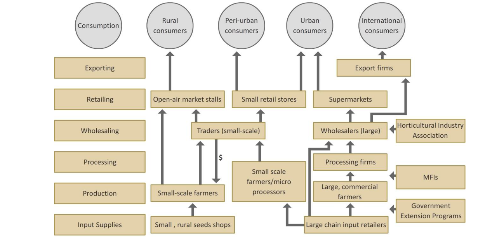

```{r setup, include=FALSE}
library(knitr)
require(tidyverse)
set.seed(453)
# invalidate cache when the package version changes
knitr::opts_chunk$set(tidy = FALSE, echo = FALSE, 
                  message = FALSE, warning = FALSE,
                  out.width = "45%", cache = TRUE)
options(knitr.table.format = "latex")
options(knitr.kable.NA = "", digits = 2, knitr.kable.NAN = "")
options(kableExtra.latex.load_packages = FALSE)
```

# Value chain

## Introduction

- Porter (1985) defined value chain is a chain of activities. Products pass through all activities of the chain in order and at each activity the product gains some value.
- The value chain categorizes the generic value adding activities of an organization. 
- The "primary activities" include inbound logistics, operation (production), outbound logistics, sales and marketing, and service (maintenance). 
- The "support activities" include administrative infrastructure management, human resource management, research and development, and procurement. 
- The costs and value drivers are identified for each value activity. The value chain framework quickly makes its way to the forefront of management as a powerful analysis tool for strategic planning. 
- Its ultimate goal is to maximize value creation while minimizing cost.

## Mapping

- A value chain map graphically illustrates all of the components, and relationships between them, of the selected value chain.
- It is a visual tool that helps us understand how a particular industry works.
- Value chain maps demonstrate how a product in an industry moves from raw material through production, processing, and other steps, until it eventually winds up with the consumer.
- The map highlights the range of activities that occur within the value chain. 
- The map will also outline transformation steps or functions, actors, relationships, and support services. The level of detail in a value chain map can vary, ranging from noting the basic essentials to highly comprehensive components.

## Mapping procedure

1. Collate market research
2. Write out each step in the transformation process
3. Identify the various end markets (consumers)
4. Identify the different actors
5. Depicting relationships (Arrow diagram)
6. Representing support services (Microfinance, Government extension and other serice, NGOs, Vale chain actors)
7. Add any additional overlays
8. Add gender dimension
9. Conduct additional market research and finalize

## Value chain map: Example

```{r value-chain-map, fig.width=6, fig.height=4, out.width="85%"}

```

# Porter's value chain analysis: Approach

- Harvard Business School professor, Michael Porter, introduced a simple value chain model in his book, "Competitive Advantage". He developed the steps to perform a value chain analysis and split business activities into two categories: primary and support.

1. Determine the business' primary and support activities.

Together, the primary and support activities make up the value chain. And they include each action required in the development of a product or service, from raw material to final product.

##

2. Analyze the value and cost of the activities.

The team tasked with creating the value chain analysis should brainstorm ways each activity provides value to customers and the business as a whole. Compare the activity to the competitive advantage you're trying to achieve (cost leadership or differentiation) and see if it supports the goal.

After the value analysis is complete, take a look at the cost of the activities. Is the activity labor intensive? How much does X raw material cost? Asking questions similar to these will help identify which activities are cost-effective and which are not. This where areas for improvement can be identified.

##

3. Identify opportunities to gain a competitive advantage.

Once the value chain analysis is complete, the primary stakeholders in the business can see an overview of where the business is excelling and where improvements can be made operationally.

Begin with the improvements that take minor changes and provide high-impact results. After the easy wins are identified and actioned, you and your team can tackle the bigger challenges that might be hindering efficiency.

The value chain analysis gives businesses a clear idea of how to adjust their actions and processes to provide the most value to their target market and increase profit margins for the company.
