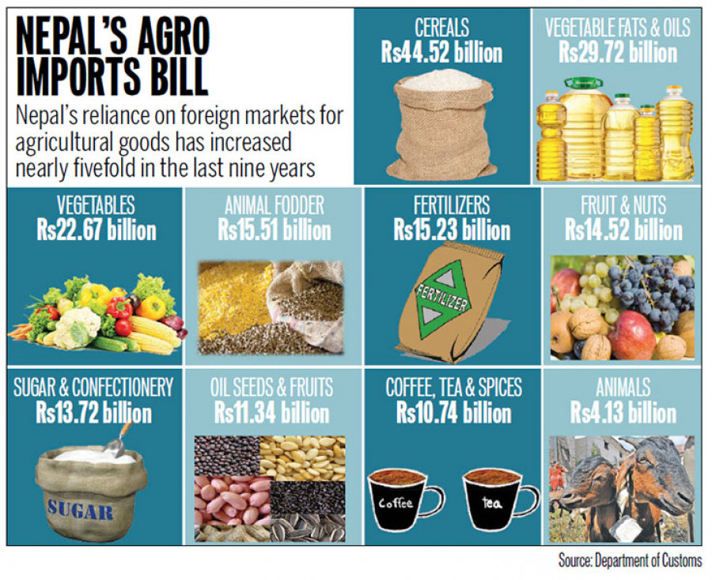

```{r setup, include=FALSE}
library(knitr)
require(tidyverse)
set.seed(453)
# invalidate cache when the package version changes
knitr::opts_chunk$set(tidy = FALSE, echo = FALSE, 
                  message = FALSE, warning = FALSE,
                  out.width = "45%", cache = TRUE)
options(knitr.table.format = "latex")
options(knitr.kable.NA = "", digits = 2, knitr.kable.NAN = "")
options(kableExtra.latex.load_packages = FALSE)
```

# Trade

## Background

- Involves the buying and selling of goods and services
- International trade allows countries expand their markets for goods and services that otherwise may not have been available
- International trade makes the trade more competitive and brings cheaper goods home.

##

**Export**

- Export to send good to another country for sale. -- Advance Learner Dictionary
- To send goods or services across national frontiers for the purpose of selling and realizing foreign exchange.

**Import**

- Import; to buy or bring in products from another country. -- Advance Learner Dictionary
- "Imports" consist of transactions in goods and services (sales, barter, gifts or grants) from non-resident residents to residents.
- An import of a good occurs when there is a change of ownership from a non-resident to a resident;
- This does not necessarily imply that the good in question physically crosses the frontier. Also smuggled goods be included in the import measurement.

# Policies and agreements in trade

## National policies

- Fiscal policy
- Trade strategies (NTIS)
- National trade policy (1992, 2015)
  - First trade policy introduced in 1983 with the slogan of "Exports for development"
  - Trade policy, 1992 removed most of the trade barriers such as eliminating licensing for import and export, establishing industry, etc.
  - Trade policy, 2015 highlights:
    - Trade in goods, trade in services and trade in intellectural property rights
    - Trade related infrastructure building
    - Product development and value chains
    - Capacity development and export promotion
    - Trade facilitation
    - Participation in the global production chains and value chains
    - Market access/promotion/diversification
    - Resource mobilization (Aid for trade), Trade related technical assistance

## International treaties and agreements

1. Indo-Nepal trade treaty
2. China-Nepal trade treaty
3. South Asian Free Trade Area (SAFTA): It provides the basis for trade liberalization programmes for LDCs and non-LDCs separately, in terms of tariff reductions and inclusion of products in the sensitive list. (Bangladesh, Bhutan, Maldives, Nepal, India, Pakistan, and Sri Lanka, Afghanistan)
4. Bay of Bengal Initiative for Multi-Sectoral Technical and Economic Cooperation (BIMISTEC): The aim of the Framework Agreement is to stimulate trade and investment among the parties, and to attract trade and investment from outside. (India, Sri Lanka, and Thailand, Bangladesh, Bhutan, Myanmar, and Nepal)
5. World Trade Organization (WTO): Nepal has been a WTO Member since 23 April 2004 when it became the first least developed country (LDC) to join the WTO through the full working party negotiation process.
  - AOA, TRIPS, SPS
  - International agreements

# Implications of national trade of HVCs

## High value crops

```{r high-value-crops}
tribble(
  ~"Traditional", ~"Non-traditional (HVA)",
  "Sugar", "Dairy products", 
  "Cotton", "Meat products", 
  "Jute", "Vegetables", 
  "Tobacco", "Fruit", 
  "Coffee", "Fish", 
  "Cocoa", "NTF products, nuts", 
  "Tea", "Species and essential oils", 
  "Bananas", "Herbs", 
  "Cereals, roots and tubers", NA, 
  "Oilseeds", NA
) %>% 
  knitr::kable(booktabs = TRUE, caption = "Traditional and high value agricultural commodities") %>% 
  kableExtra::kable_styling(font_size = 8)
```

## Implications of national trade

- Access to cheaper and nutritious food source to citizens of all geographical regions
- Strengthening of development infrastructures -- transport, electricity, communication channels
- More balanced economic and physical growth
- Affordable access to HVCs will direct competitive production of other agricultural commodities
- Equitable share of food items helps in achieving food security
- Opportunity for quality awareness in local consumers
- Establishment of small and medium scale processing agribusiness enterprises.

<!-- ```{r nepal-export-import-major-cereals} -->
<!-- nepal_expimp_cereal <- read_csv("./../data/nepal_export_import_major_cereals.csv") -->

<!-- nepal_expimp_cereal %>%  -->
<!--   filter(Item %in% c("Maize", "Rice, paddy", "Wheat")) %>%  -->
<!--   ggplot(aes(x = Year, y = Value, color = Item)) + -->
<!--     geom_line() -->
<!-- ``` -->

# Implications of international trade in agriculture sector

##

- Nepal is a net importer of agricultural products
- Exports of agricultural products declined in 2015 compared to 2013 and 2014
- Nepalese economy is still dependent highly on tariff revenue
- Nepal imports pretty much all types of goods and services that are consumed in the domestic market
- Causes of import:
  - Import share of petroleum products is about 25\%.
  - The process of development caused increased import
  - Increase in purchasing power of the people
  - Weak commercialization and negotiation ability
  - Standard issues

##

```{r food-import-nepal, fig.cap="Food import expenses for Nepal during year 2018 AD", fig.width=4, out.width="80%"}

```


## Impacts of trade liberalization and WTO in agriculture

- Opportunities:
  1. Market access
  2. Attract foreign direct investment
  3. Improvement of domestic institutional capability
  4. Benefit from liberalization
  5. Access to dispute settlement body
  6. Mobilization of trade related technical assistance

##

- Challenges:
  - Nepal's widening trade deficit due to increasing import as result of easy access of foreign products in our market
  - Lack of trading infrastructure making Nepalese products difficult to compete in world market
  - Limited availability of Sanitary and Phytosanitary quarantine inspection and food testing lab at border in Nepal
  - Reduction in export subsidy that demotivated the exporting producers
  - Lack of quality and quantity production of agriculture products which made it less competitive in world market
  