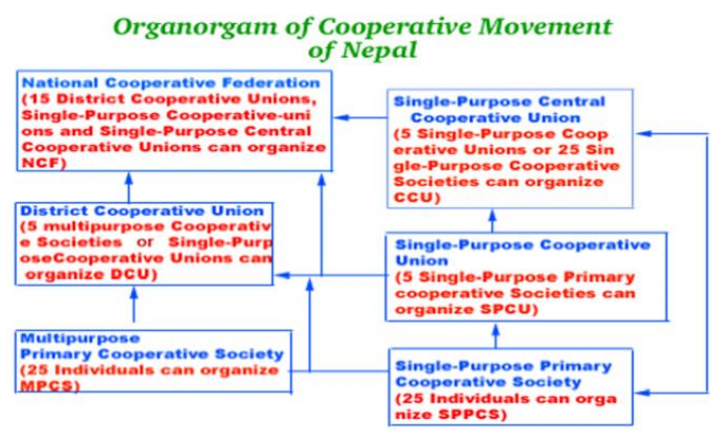

```{r setup, include=FALSE}
library(knitr)
require(tidyverse)
set.seed(453)
# invalidate cache when the package version changes
knitr::opts_chunk$set(tidy = FALSE, echo = FALSE, 
                  message = FALSE, warning = FALSE,
                  out.width = "45%", cache = TRUE)
options(knitr.table.format = "latex")
options(knitr.kable.NA = "", digits = 2, knitr.kable.NAN = "")
options(kableExtra.latex.load_packages = FALSE)
```

# Introduction

## Definition

- A cooperative is an autonomous association of people who voluntarily cooperate for their mutual social, economic, and cultural benefit. 
- Includes non-profit community organizations and businesses that are owned and managed by the people who use its services (a consumer cooperative) or by the people who work there (a worker cooperative) or by the people who live there (a housing cooperative).
- In short: "a jointly owned enterprise engaging in the production or distribution of goods or the supplying of services, operated by its members for their mutual benefit, typically organized by consumers or farmers."
- Co-operatives frequently have social goals which they aim to accomplish by investing a proportion of trading profits back into their communities.
- The Rochdale Society of Equitable Pioneers, founded in 1844, is usually considered the first successful cooperative enterprise. They set up the society to open their own store selling food items they could not otherwise afford.

## Principles^[Adopted by the international cooperative alliance in 1995]

\footnotesize

1. Voluntary and open membership
  - Cooperatives are open to all people willing to volunteer to use its services and willing to accept the responsibilities of membership, without gender, social, racial, political or religious discrimination.
2. Democratic member control
  - Those who buy the goods or use the services of the cooperatives also actively participate in setting policies and making decisions.
3. Members' economic participation
  - Members contribute equally to and democratically control the capital of the cooperative.
  - Benefits are distributed proportionally to each member's level of participation in the cooperative, for instance, by a dividend on sales or purchases, rather than according to capital invested.
  
##

4. Autonomy and independence
5. Education, training and information
6. Cooperation among cooperatives
7. Concern for community

# Organization/structures

##

```{r organogram-cooperatives, fig.width=6, out.width="80%"}

```

##

\footnotesize

1. Producer co-operatives: Some co-operatives process and market their members' products and services directly while others may also sell the input necessary to their members' economic activities. Examples: Agriculture cooperatives, pooling of equipment, advisory services, etc.

2. Multi-stakeholder co-operatives: The membership of these co-operatives is made of different categories of members who share a common interest in the organization. Examples: home care services, health services, community services, etc.

3. Worker co-operatives: The purpose of these co-operatives is to provide their members with work by operating an enterprise. The co-operatives are owned by their employee members. Examples: forestry, leisure, production and manufacturing, tourism, communications and marketing, etc.

##

4. Worker-Shareholder co-operatives: These are incorporated co-operatives that hold partial ownership of the business in which the co-operative members are employed. Because of its share capital, the co-operative may participate in the management of the business and the workers may influence work organization. Examples: production and manufacturing, technology, etc.

5. Consumer co-operatives: A consumers' cooperative is a business owned by its customers. Employees can also generally become members. Members vote on major decisions and elect the board of directors from among their own number. They provide their members with goods and services for their personal use. Examples: Food, credit unions, housing, insurance co-operatives, etc.

# Roles of cooperative in commercial farming

##

\footnotesize

- Agricultural cooperatives play an important role in food production and distribution, and in supporting long-term food security. 
- Agricultural cooperatives play an important role in supporting small agricultural producers and marginalized groups such as young people and women. 
<!-- - Empower members economically and socially and create sustainable rural employment through business models that are resilient to economic and environmental shocks. -->
- Cooperatives offer small agricultural producers opportunities and a wide range of services, including improved access to,
  - markets, 
  - natural resources, 
  - information, 
  - communications, 
  - technologies, 
  - credit, 
  - training, and 
  - warehouses. 

##

\footnotesize

- Facilitate smallholder producers' participation in decision-making at all levels, support them in securing land-use rights, and negotiate better terms for engagement in contract farming and lower prices for agricultural inputs such as seeds, fertilizer and equipment. 
- Through this support, smallholder producers can secure their livelihoods and play a greater role in meeting the growing demand for food on local, national and international markets, thus contributing to poverty alleviation, food security and the eradication of hunger. 
- Agricultural cooperatives also promote the participation of women in economic production
  - women are able to unite in solidarity and provide a network of mutual support to overcome cultural restrictions to pursuing commercial economic activities. 
  - For example, women-only cooperatives in South Asia facilitate economic independence and improve the social standing of women through their active participation in businesses and management.

# Cooperatives laws and by-laws

## National cooperative federation of Nepal (NCFN)

- Established in June 20, 1993 under the Co-operative Act, 1992 
- The apex body of the cooperative movement of all types and levels of cooperatives organized on the basis of universally accepted cooperative values and principles. 
- Represents in government, national and international forum on behalf of all cooperatives. 
- There are more than 24 thousand Primary Cooperatives, 223 District Level Cooperative Unions, 14 Central Cooperative Unions and 1 National Cooperative Bank under the umbrella of NCFN. 
- There are more than 3.2 million cooperative members including around 42 percent women membership. (Source: Department of Cooperatives, July 15, 2011)
- NCFN is a member of International Cooperative Alliance (ICA), Geneva. It is also affiliated with the Network for the Development of Agricultural Cooperatives (NEDAC), Thailand.

